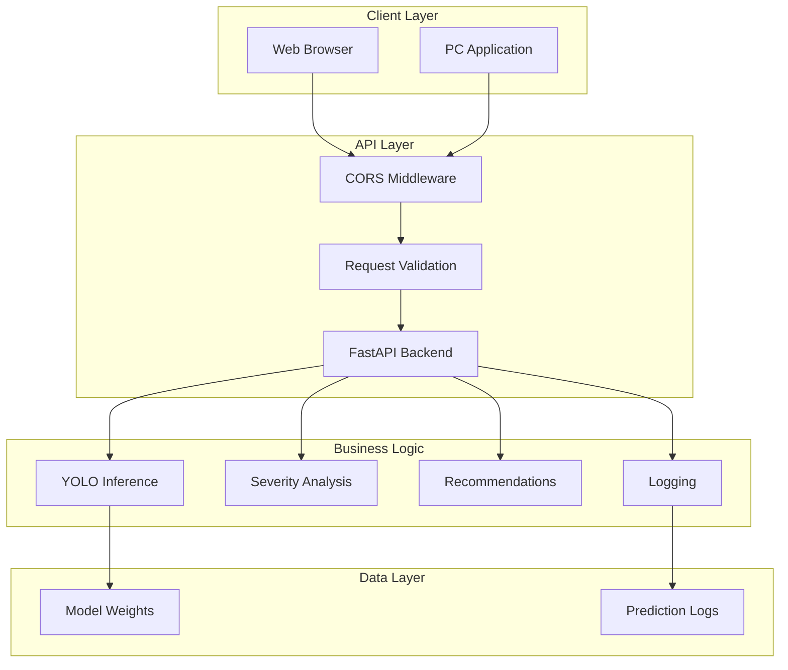

# System Architecture

## Overview

The Cotton Leaf Disease Detection System follows a modern microservices architecture with clear separation of concerns.

## Architecture Diagram

## Component Description

### Frontend (React)
- **Technology**: React 18 + Vite
- **Styling**: Tailwind CSS
- **Routing**: React Router
- **API Client**: Axios

### Backend (FastAPI)
- **Framework**: FastAPI
- **ML Framework**: PyTorch + Ultralytics
- **Image Processing**: OpenCV
- **Validation**: Pydantic

### PC Application
- **Framework**: PyQt5
- **Camera**: OpenCV
- **API Client**: Requests

### Model
- **Architecture**: YOLOv9
- **Input**: 640x640 RGB images
- **Output**: Bounding boxes + class predictions
- **Classes**: 4 (3 diseases + healthy)

## Data Flow

1. **Image Upload**:
   - User uploads image via web/PC app
   - Image sent to backend via multipart/form-data
   - Backend validates and preprocesses image

2. **Inference**:
   - Preprocessed image fed to YOLOv9 model
   - Model outputs bounding boxes and class predictions
   - Post-processing applies NMS and filters by confidence

3. **Analysis**:
   - Detections analyzed for severity
   - Treatment recommendations generated
   - Results logged to JSON file

4. **Response**:
   - Structured JSON response sent to client
   - Client displays results with visualizations

## Security Considerations

- CORS configured for allowed origins
- File upload size limits enforced
- Input validation on all endpoints
- No sensitive data stored

## Scalability

- Stateless API design
- Horizontal scaling possible
- Model can be cached in memory
- Async request handling

## Performance Optimization

- Model loaded once at startup
- GPU acceleration when available
- Efficient image preprocessing
- Response compression
