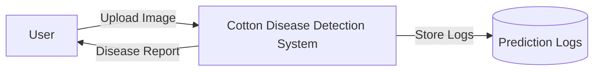
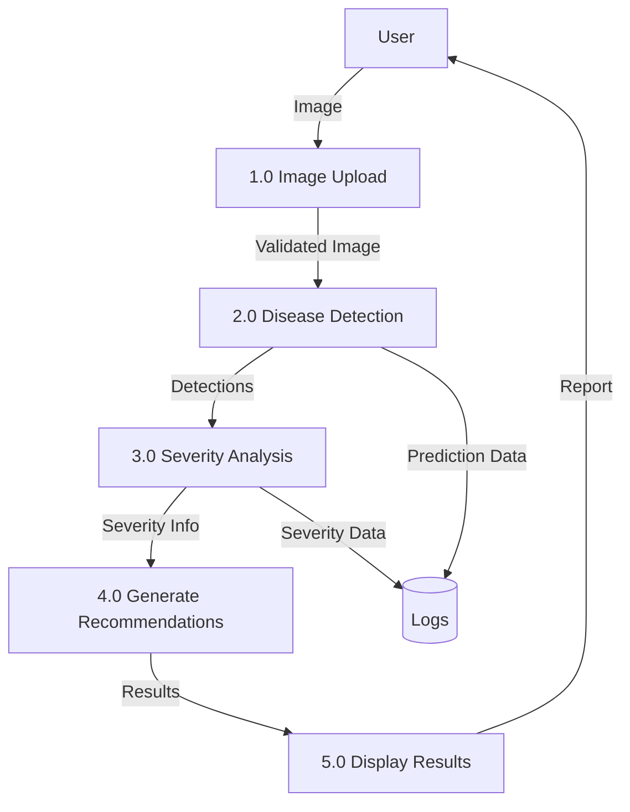
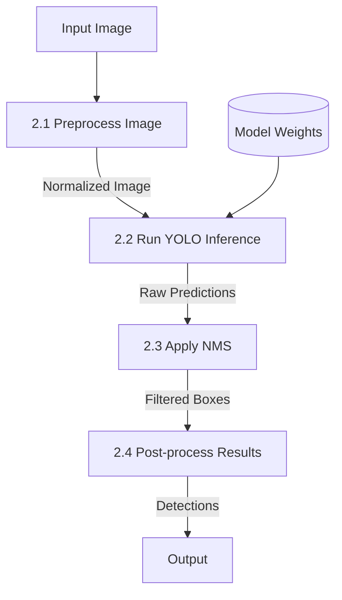
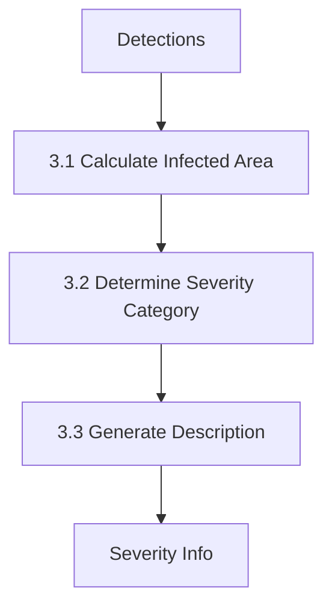
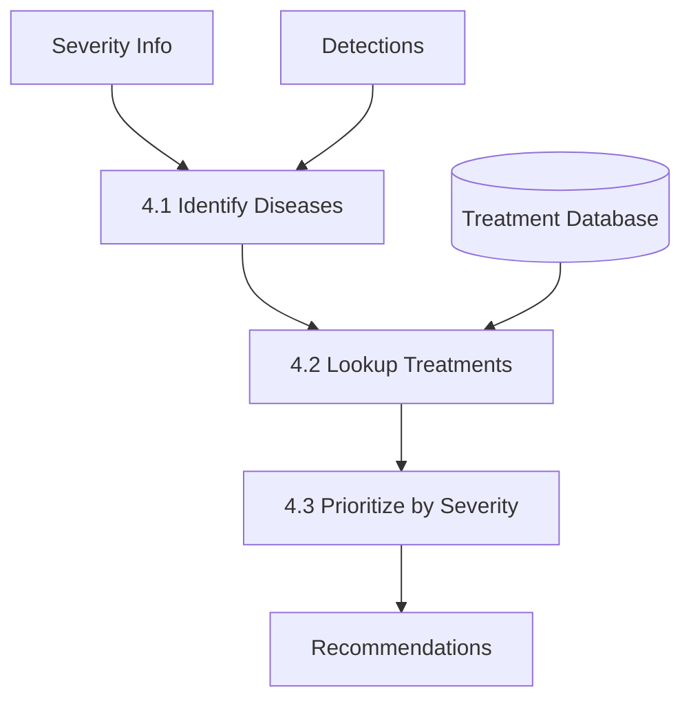

# Data Flow Diagrams

## DFD Level 0 (Context Diagram)

## DFD Level 1 (Major Processes)

## DFD Level 2 (Detailed Processes)

### 2.0 Disease Detection (Detailed)

### 3.0 Severity Analysis (Detailed)

### 4.0 Generate Recommendations (Detailed)

## Data Stores

1. **Model Weights**: Pre-trained YOLOv9 model
2. **Prediction Logs**: JSON file with historical predictions
3. **Treatment Database**: In-memory dictionary of recommendations

## External Entities

1. **User**: Interacts via web browser or PC app
2. **Camera**: Provides live video feed (optional)
