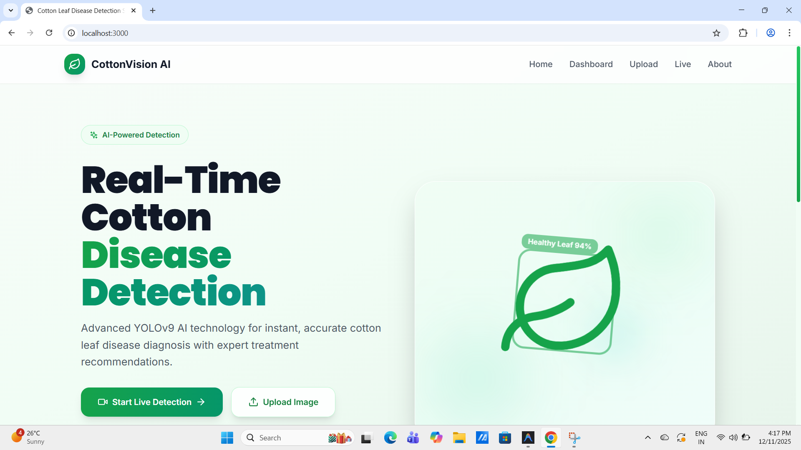

Real-Time Cotton Leaf Disease Detection System Using YOLOv9

Overview:
This project detects cotton leaf diseases using the YOLOv9 deep learning model. 
The system analyzes leaf images and identifies diseases in real time.

Technologies Used:
- Python
- YOLOv9
- OpenCV
- PyTorch

Features:
- Real-time disease detection
- Image-based disease classification
- Deep learning model training

How to Run:
1. Clone the repository
2. Install required libraries
3. Run the detection script

Author:
Sudeep Reddy K

Home Page

